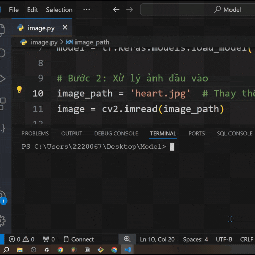

# 📌Project Name : Fit Your Style

## 📝Description
A brief description of the project:  
What does the project do:

- This project uses OpenCV and deep learning to identify your face shape.
- Based on the result, the system suggests suitable hairstyles and includes an AR (Augmented Reality) feature that lets you try them on in real-time.

## 🔑Key Features

- Face shape recognition
- Hairstyle Suggestions
- Virtual reality hair try on
- Book a haircut appointment

## 🛠️Technologies Used
- **Languages**: Python
- **Frameworks**: Django, TensorFlow
- **Libraries**: OpenCV, Mediapipe
- **Front End**: CSS, JavaScript
- **Database**: SQlite
