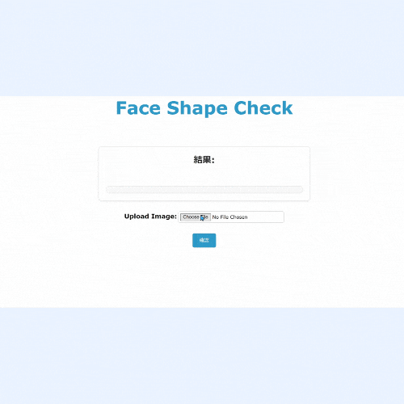
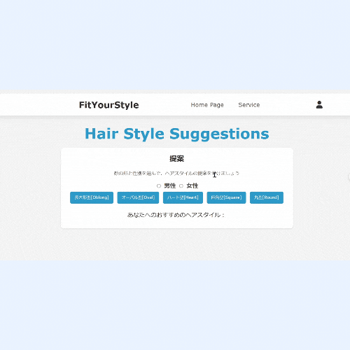
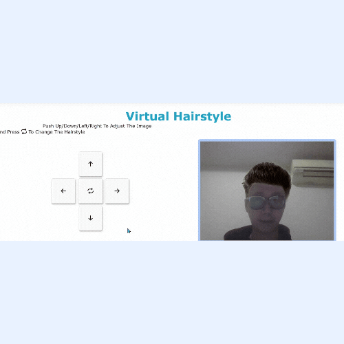

# 📌Project Name : Fit Your Style

## 📝Description
What does the project do:
- This project uses OpenCV + Mediapipe library and Deep Learning to identify your face shape (Oblong, Round, Oval, Heart, Square)
- Based on the result, the system suggests suitable hairstyles and includes an AR (Augmented Reality) feature that lets you try them on in real-time.

## 🔑Key Features
- Face shape recognition

- Hairstyle Suggestions

- Virtual reality hair try on

## User Flow Process

1. **Upload Photo 📤**: Users upload a front-facing photo from their device .

2. **Face Shape Detection 📐**: The AI system analyzes and identifies the user's face shape.

3. **View Hairstyle Suggestions 💡**: A list of hairstyles suitable for the user's face shape is displayed.

4. **Hair Try-On 💇‍♀️✨**: Users can try hairstyles directly on their uploaded photo.

5. **Book an Appointment 📅**: Select the preferred hairstyle and book an appointment at the salon.

## 🛠️Technologies Used
- **Languages**: Python
- **Frameworks**: Django, TensorFlow
- **Libraries**: OpenCV, Mediapipe
- **Front End**: CSS, JavaScript
- **Database**: SQlite
